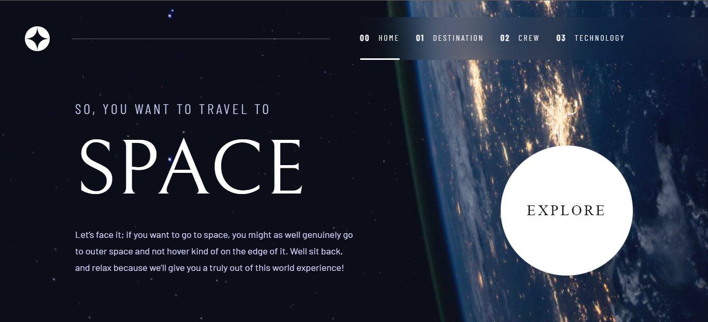

# Frontend Mentor - Space tourism website solution

This is a solution to the [Space tourism website challenge on Frontend Mentor](https://www.frontendmentor.io/challenges/space-tourism-multipage-website-gRWj1URZ3). Frontend Mentor challenges help you improve your coding skills by building realistic projects. 

## Table of contents

- [Overview](#overview)
  - [The challenge](#the-challenge)
  - [Screenshot](#screenshot)
  - [Links](#links)
- [My process](#my-process)
  - [Built with](#built-with)
  - [What I learned](#what-i-learned)
  - [Useful resources](#useful-resources)

## Overview

### The challenge

Users should be able to:

- View the optimal layout for each of the website's pages depending on their device's screen size
- See hover states for all interactive elements on the page
- View each page and be able to toggle between the tabs to see new information

### Screenshot

### Links

- Solution URL: [Add solution URL here](https://your-solution-url.com)
- Live Site URL: [Space Tourism](https://boristenkes-space-tourism.netlify.app/)

## My process

### Built with

- Semantic HTML5 markup
- CSS custom properties
- Flexbox
- Mobile-first workflow
- Vanilla JavaScript
- [Sass](https://sass-lang.com/)
- [Vite](https://vitejs.dev/)

### What I learned

- Data handling in Javascript
- Vite

### Useful resources

- CSS Resets - [meyerweb](https://meyerweb.com/eric/tools/css/reset/), [joshwcomeau](https://www.joshwcomeau.com/css/custom-css-reset/)
- [Kevin's video](https://www.youtube.com/watch?v=VWfzZuhAf_Q) - Helped me a lot with orgranizing my Sass files and Sass in general.
